#  ASP.NET CORE 笔记

1.创建一个web应用程序，必须是.net core 

## 运行方式

第一种，直接在我们的目录下面执行

dotnet  run 

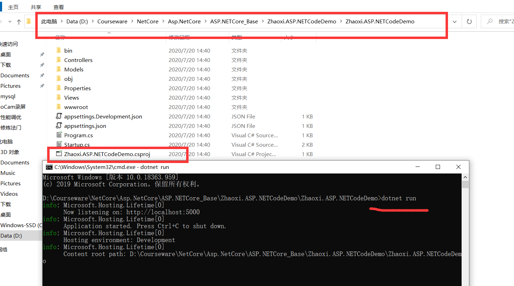

~~~shell
相当于，我们编译又运行
不能更改我们端口号
~~~

第二种，直接切换到我们根目录下面\bin\Debug\netcoreapp3.1

运行

dotnet  应用程序的名称.dll --urls="http://localhost:8080"

可以根据我们自己定义的端口号来运行

存在一个问题：就是没有吧样式加载进去，需要我们手动的把wwwroot拷贝到我们的根目录下面\bin\Debug\netcoreapp3.1

# AOP思想

不同于我们asp.net （全家桶，冗余，你要不要，都给我们加载进来）

asp.netcore 它是可以给我们自由选择，需要用什么，就可以自己去选择加载服务

比如，使用session

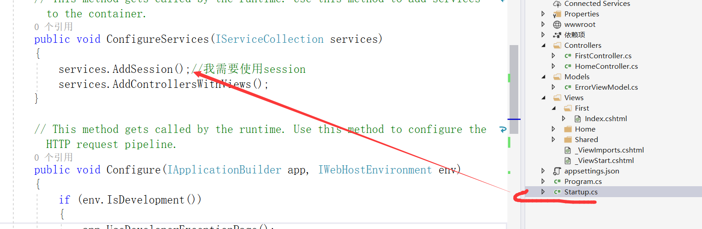

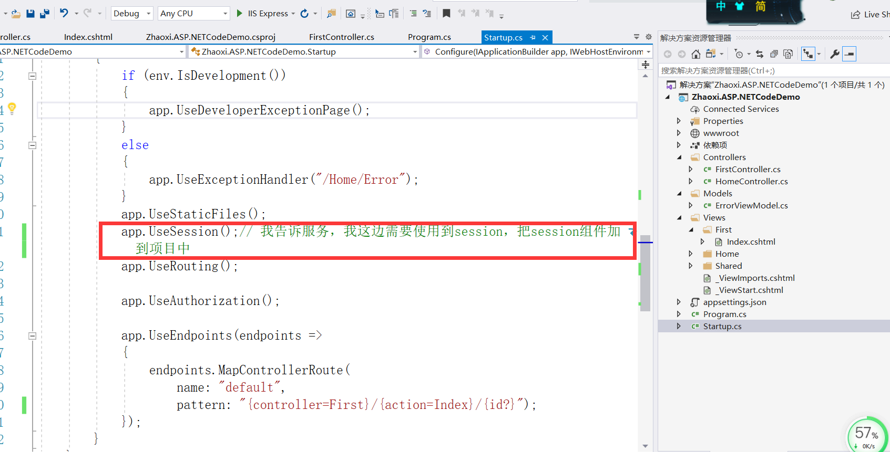

# 使用日志插件

## 1.使用log4

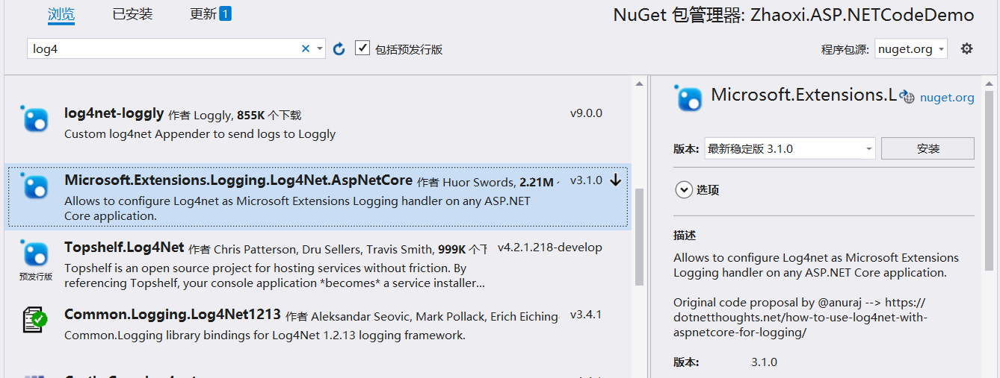

需要一个配置文件

告诉系统，我们需要使用log4

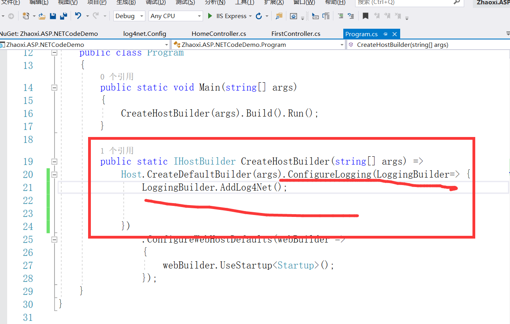

第二种注入方式

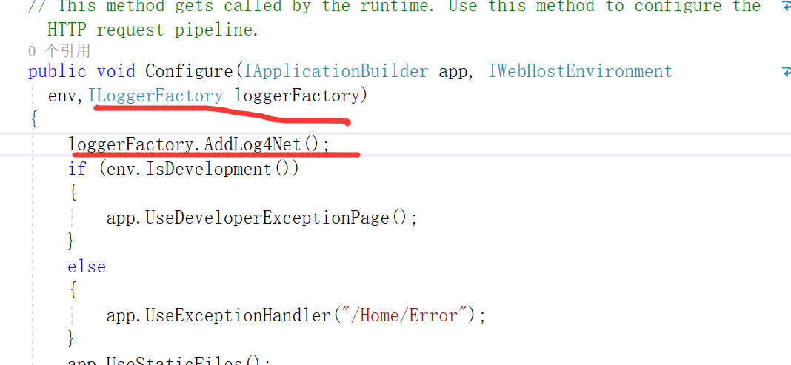

配置文件log4net.Config

~~~json
<?xml version="1.0" encoding="utf-8"?>
<log4net>
  <!-- Define some output appenders -->
  <appender name="rollingAppender" type="log4net.Appender.RollingFileAppender">
    <file value="log\log.txt" />
    <!--追加日志内容-->
    <appendToFile value="true" />

    <!--防止多线程时不能写Log,官方说线程非安全-->
    <lockingModel type="log4net.Appender.FileAppender+MinimalLock" />

    <!--可以为:Once|Size|Date|Composite-->
    <!--Composite为Size和Date的组合-->
    <rollingStyle value="Composite" />

    <!--当备份文件时,为文件名加的后缀-->
    <datePattern value="yyyyMMdd.TXT" />

    <!--日志最大个数,都是最新的-->
    <!--rollingStyle节点为Size时,只能有value个日志-->
    <!--rollingStyle节点为Composite时,每天有value个日志-->
    <maxSizeRollBackups value="20" />

    <!--可用的单位:KB|MB|GB-->
    <maximumFileSize value="3MB" />

    <!--置为true,当前最新日志文件名永远为file节中的名字-->
    <staticLogFileName value="true" />

    <!--输出级别在INFO和ERROR之间的日志-->
    <filter type="log4net.Filter.LevelRangeFilter">
      <param name="LevelMin" value="ALL" />
      <param name="LevelMax" value="FATAL" />
    </filter>
    <layout type="log4net.Layout.PatternLayout">
      <conversionPattern value="%date [%thread] %-5level %logger - %message%newline"/>
    </layout>
  </appender>
  <root>
    <priority value="ALL"/>
    <level value="ALL"/>
    <appender-ref ref="rollingAppender" />
  </root>
</log4net>

~~~

## 2.使用NLog

首先nuget NLog.Web.AspNetCore

然后，新建一个nlog.config文件

~~~json
<?xml version="1.0" encoding="utf-8" ?>
<nlog xmlns="http://www.nlog-project.org/schemas/NLog.xsd"
      xmlns:xsi="http://www.w3.org/2001/XMLSchema-instance"
      autoReload="true"
      internalLogLevel="Info"
      internalLogFile="c:\temp\internal-nlog.txt">

  <!-- enable asp.net core layout renderers -->
  <extensions>
    <add assembly="NLog.Web.AspNetCore"/>
  </extensions>

  <!-- the targets to write to -->
  <targets>
    <!-- write logs to file  -->
    <target xsi:type="File" name="allfile" fileName="c:\temp\nlog-all-${shortdate}.log"
            layout="${longdate}|${event-properties:item=EventId_Id}|${uppercase:${level}}|${logger}|${message} ${exception:format=tostring}" />

    <!-- another file log, only own logs. Uses some ASP.NET core renderers -->
    <target xsi:type="File" name="ownFile-web" fileName="c:\temp\nlog-own-${shortdate}.log"
            layout="${longdate}|${event-properties:item=EventId_Id}|${uppercase:${level}}|${logger}|${message} ${exception:format=tostring}|url: ${aspnet-request-url}|action: ${aspnet-mvc-action}" />
  </targets>

  <!-- rules to map from logger name to target -->
  <rules>
    <!--All logs, including from Microsoft-->
    <logger name="*" minlevel="Trace" writeTo="allfile" />

    <!--Skip non-critical Microsoft logs and so log only own logs-->
    <logger name="Microsoft.*" maxlevel="Info" final="true" />
    <!-- BlackHole without writeTo -->
    <logger name="*" minlevel="Trace" writeTo="ownFile-web" />
  </rules>
</nlog>

<!--Trace - very detailed logs，包含大量的信息，例如 protocol payloads。该级别一般仅在开发环境中启用。
Debug - debugging information, 比 Trance 级别稍微粗略，一般在生产环境中不启用。
Info - information messages，一般在生产环境中启用。
Warn - warning messages，一般用于可恢复或临时性错误的非关键问题。
Error - error messages，一般是异常信息。
Fatal - 非常严重的错误！-->
~~~

3.加载组件

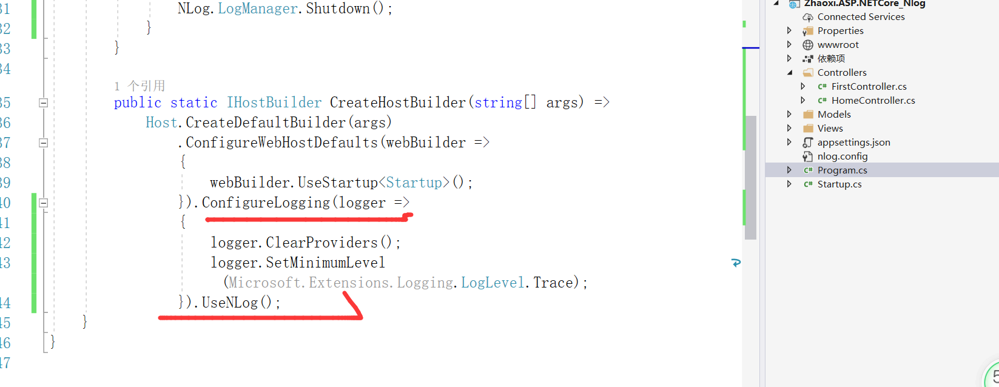

4.加载配置文件，并设置

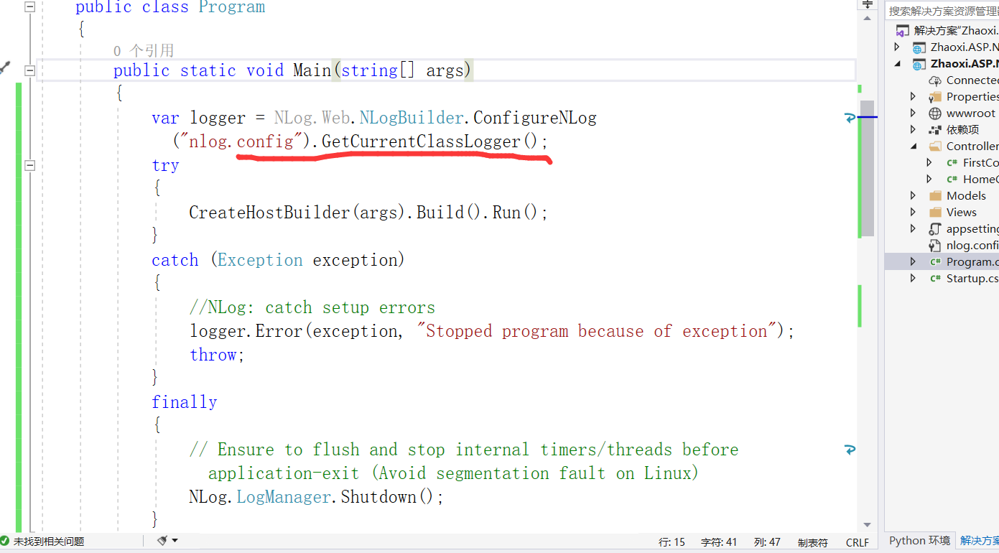

# 发布部署

1.同步发布的包才能在iis上面发布

前提条件是iis模块里面有一个服务要安装

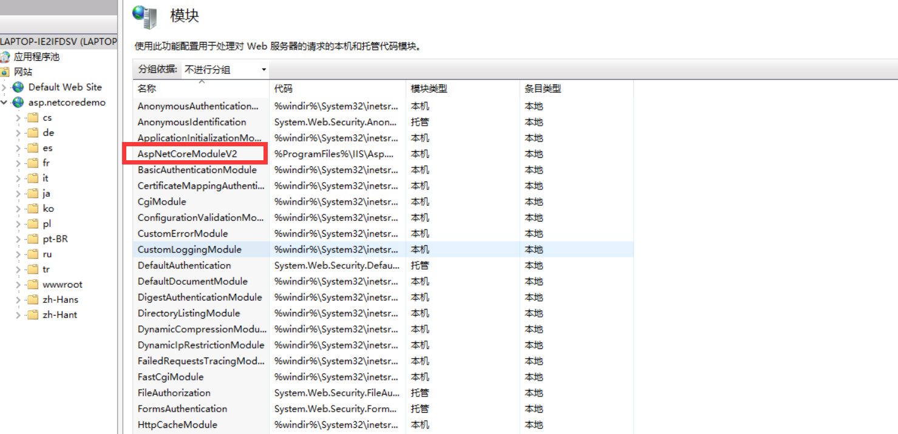

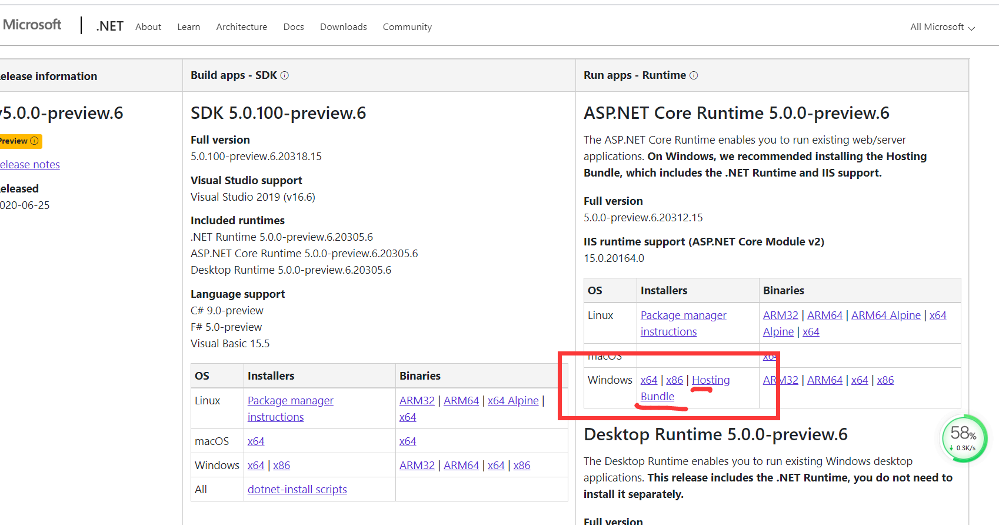

2.看一步需要发布，直接指定到我们的根目录

但是必须有一个配置文件web.config

~~~xml
<?xml version="1.0" encoding="utf-8"?>
<configuration>
  <location path="." inheritInChildApplications="false">
    <system.webServer>
      <handlers>
        <add name="aspNetCore" path="*" verb="*" modules="AspNetCoreModuleV2" resourceType="Unspecified" />
      </handlers>
      <aspNetCore processPath="dotnet" arguments=".\Zhaoxi.ASP.NETCodeDemo.dll" stdoutLogEnabled="false" stdoutLogFile=".\logs\stdout" hostingModel="inprocess" />
    </system.webServer>
  </location>
</configuration>
<!--ProjectGuid: E51D7B34-5274-427B-B9B2-9CF716C7C914-->
~~~

# EFCore

1.首先创建一个.NETCore的程序集

2.nuget 依赖包

  ~~~shell
#Microsoft.EntityFrameworkCore
#Microsoft.EntityFrameworkCore.SqlServer.Design
#Microsoft.EntityFrameworkCore.Tools
#Microsoft.EntityFrameworkCore.SqlServer
  ~~~

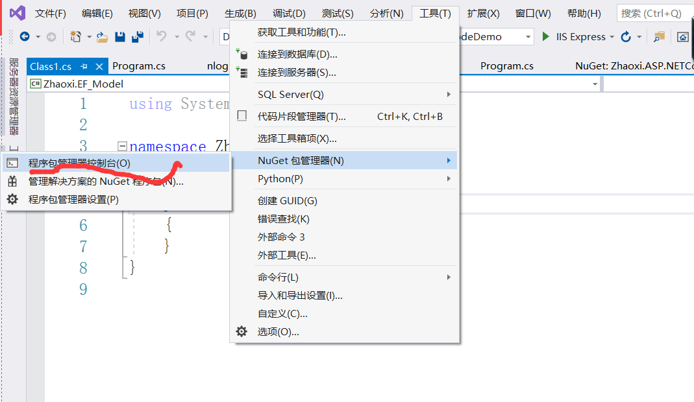

3.执行指令

Scaffold-DbContext -Connection "Server=127.0.0.1;Database = demo; Integrated Security = False; User ID =sa ; Password =123456 " -Provider "Microsoft.EntityFrameworkCore.SqlServer" -OutputDir Models

4.注意，如果执行报错，则需要把其他的项目，卸载掉，然后执行，执行成功之后，再去执行我们的指令，生成相关的model,和dbcontext